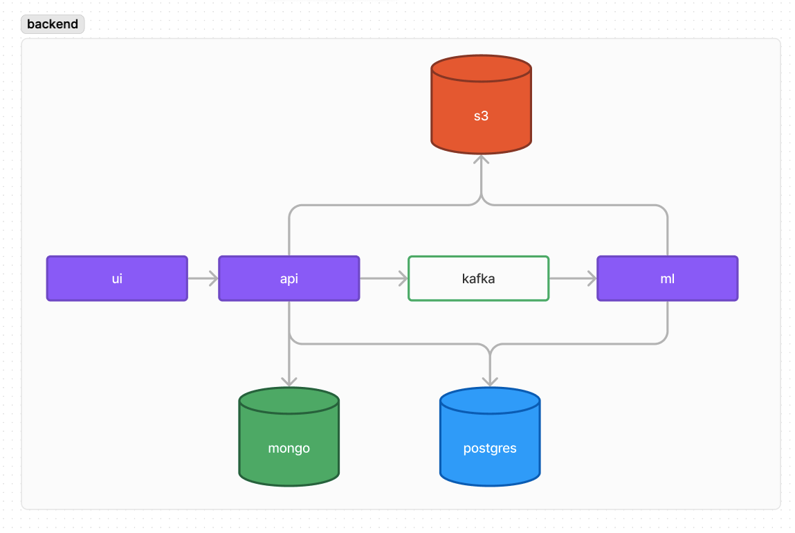

# Описания решения
Система реализует функционал визуализации и прогнозирования возможных инцидентов связанных с отоплением. Архитектура решения:


Сервис состоит из 3 основных частей: 
# ui
1. Предназначен для отображения карты и фильтрации по текущим  инцидентам и отображением результатов обработки и работы ml модели. 
2. Реализует точку входа для новых данных есть возможность загрузки файла с событиями за промежуток времени, для агрегации в системе.
3. Предлагает дальнейшие действия для устранения инцидента
# api
1. Основной компонент системы, предназначенный для обработки запросов пользователей на отображение, загрузку и фильтрацию по инцидентам
# ml
1. Используется для расчетов агрегированных параметров для переобучения и запуска модели предсказания нештатных ситуаций, на вход принимает диапозон времени и списком уном строений. На выходе получаем вероятности и вероятности для указаных типо инцидентов  и "вероятности факторов" которые на это влияют. Для переобучения модели требуются следующие данные для улучшения прогнозирования для строений из других районов:
	1. Таблицы формата: `5. Перечень событий за период 01.10.2023-30.04.2023 (ЦУ КГХ)`
	2. Плановые-Внеплановые отключения 01.10.2023-30.04.2023.xlsx
	3. `11.Выгрузка_ОДПУ_отопление_ВАО_20240522.xlsx`
	4. `13. Адресный реестр объектов недвижимости города Москвы.xlsx
2. Обучение модели на данных, которые не зависят от географических признаков
3. Предварительная обработка новых данных для системы (пользовательских выгрузок инцидентов из внешней системы)

# Установка
## 1. Склонировать репозиторий
```bash
git clone https://github.com/EgorTarasov/lct-2024
```

## 2. Провести настройку окружения
В папке config находится .env.example с переменными окружения для запуска docker compose 
его требуется скопировать в .env и заполнить значения переменных окружения
```bash
cp config/.env.example config/.env
```
После чего требуется экспортировать переменные окружения
```bash
source config/.env
```

## 3. Настройки приложений
В папке config находятся файлы конфигурации для каждого приложения: 
- api.yaml для сервиса на go

> После запуска приложения так же требуется создание bucket в s3 
> и получение credentials для работы функционала с отчетностью и файлами 

## 4. Запуск приложений
Для запуска приложений требуется запустить docker compose 
и выполнить миграции для бд с использованием [goose](https://github.com/pressly/goose) 
инструкцию по установки можно найти тут [интсрукция](https://github.com/pressly/goose?tab=readme-ov-file#install)  

В папке `api` расположен Makefile запустив который с командой `migration-up` 
вы сопоставите версию бд с требуемой для работы сервиса *можно указывать параметры подключения к бд через переменные окружения (см `api/Makefile`)*  

В папке api выполните команду
```bash
make migration-up
```
После чего получите вывод от goose о выполнении миграций:
```
➜  api git:(dev-backend) ✗ make migration-up 
goose -dir "/Users/user/lct-2024/api/cmd/migrations" postgres "user=Dino password=Dino-misos2024 dbname=dev host=192.168.1.70 port=54000 sslmode=disable" up
2024/06/15 15:17:46 goose: no migrations to run. current version: 20240613181516
```

## 5. Запуск docker-compose
Для запуска приложений требуется перейти в директорию `docker` и выполнить команду
```bash
cd docker
docker-compose up
```
После чего все сервисы будут запущены и веб интерфейс будет доступен по адресу `http://localhost:3000`

## 6. Локальный запуск
Замечение версия веб-приложения использует запросы к нашему api в случае развертки 
на другом сетевом адресе требуется заново собрать образ для `ui` указав другое название тэка при сборке в `frontend/Makefile` и дальнейшего использования в docker-compose  

# ЦА
1. Диспетчеры и операторы службы поддержки

Есть возможность быстрого выявления и регистрации инцидентов, более подробного ответа на запросов жителей, основываясь на данных об объектах и внутри инцидентов, возможность более эффективно взаимодействовать с инженерами и техническими специалистами.

Как сервис удовлетворяет их потребности:

 • Автоматические уведомления о поломках и инцидентах.

 • Система для регистрации, выявления и управления инцидентами

 • Возможность назначения ответственных сотрудников

  

2. Сотрудники групп реагирования

Потребности:

 • Оперативный доступ к информации об инцидентах.

 • Инструменты для анализа и диагностики проблем.

 • Обратная связь и координация с другими специалистами.

Как сервис удовлетворяет их потребности:

 • Мобильное приложение для получения информации в реальном времени.

 • Подробная история инцидентов и данные с приборов учета.

 • Возможность оставлять комментарии и обновлять статус инцидентов.

  

3. Руководители и менеджеры

Потребности:

 • Инструменты для анализа эффективности работы и принятия стратегических решений.

 • Отчеты и дашборды для мониторинга ключевых показателей.

Как сервис удовлетворяет их потребности:

 • Автоматические отчеты и дашборды для визуализации данных.

 • Инструменты для анализа инцидентов и планирования профилактических работ.

  

4. Административные органы и муниципальные власти

Потребности:

 • Контроль за состоянием городской инфраструктуры.

 • Принятие решений на основе актуальной и точной информации.

Как сервис удовлетворяет их потребности:

 • Централизованный доступ к информации о состоянии объектов и инцидентах.

 • Возможность мониторинга ремонтных работ и профилактических мероприятий.

 • Данные для принятия стратегических решений и планирования городского хозяйства.

  

5. Пользователи конечные (жители, арендаторы)

Потребности:

 • Доступ к информации о состоянии их зданий.

Как сервис удовлетворяет их потребности:

 • Возможность просмотра текущего состояния и истории инцидентов.

 • Обратная связь с диспетчерами и службой поддержки.
